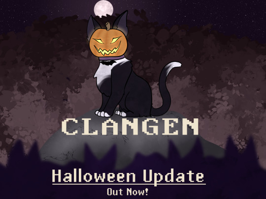

*"Boys and girls of every age,
Wouldn't you like to see something strange?
Come with us and you will see
This our Clan of Halloween!"*

This is Halloween! It's time for an update! The team has worked extremely hard to get this out in time for spooky season and really hope you enjoy the spooky nature of this update. There's new art, new patrols, and new sprites galore in the spirit of Halloween!

<!-- more -->

- Festive Halloween patrols will now start appearing around the spooky season!
- Expanded our ability to restrict events and patrols to certain date ranges.
- Added a toggle to prevent a cat from retiring
- Added a toggle to limit a cat's romantic interactions and prevent automatic mate changes.
- Many settings are now stored on a per-clan basis.
- New Loading Animations
- New Murder Reveal Events!
- Under the hood, patrols have been significantly refactored.
- Added Masked Tabbies!
- New White Patches: BOWTIE, MUSTACHE, REVERSEHEART, SPARROW, VEST, LOVEBUG, TRIXIE, SPARKLE, RIGHTEAR, LEFTEAR, ESTRELLA, REVERSEEYE, BACKSPOT, EYEBAGS, FADEBELLY, SAMMY, FRONT, BLOSSOMSTEP, BULLSEYE, SHOOTINGSTAR, EYESPOT, PEBBLE, TAILTWO, BUDDY. FCONE, FCTWO, MIA, DIGIT, SCAR, BUSTER, FINN, KROPKA, HAWKBLAZE, LOCKET, PRINCESS, ROSINA, CAKE
- New Vitiligo Pattern: SMOKEY
- New Tortie Patch Patterns: SMOKE, GRUMPYFACE, BRIE, BELOVED, SHILOH, BODY
- New Plains Background: Wasteland.
- New thoughts, patrols, and events!
- New names!
- New patrol art!
- Adjustments to grief events. In some cases, grief events are replaced by grief thoughts.
- Added "Change to Nonbinary" Button
- Dead cats can now be sorted by total age (age living + age dead)
- Cat relationships will show strong relationships first.
- Change the way spritesheets are stored in memory. This significantly decreases memory usage.
- Lots of bugfixes!