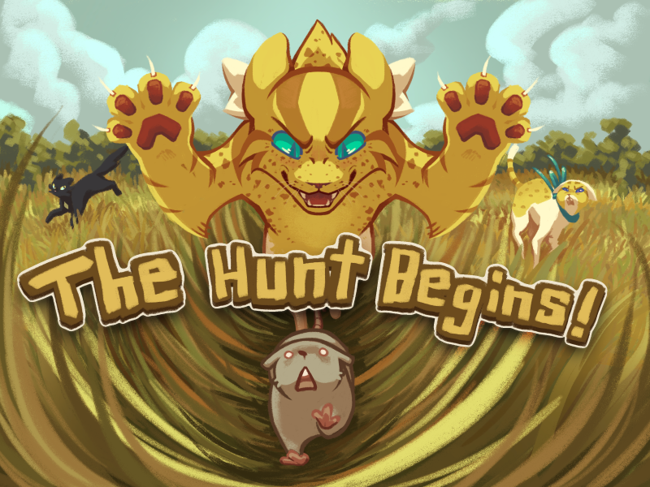

Hello, dear furends, gather round! The breeze off the lake is cool and refreshing, and the freshkill pile is stocked full. All cats will eat well tonight— though in leaner times, harsher times, purrhaps some cats may find themselves lashing out at their Clanmates... The world is wonderful, ever-growing, but all the more dangerous fur it. It's time ClanGen expanded to match.

<!-- more -->

- Feature: Freshkill pile & nutrition system
- Feature: “Destroy accessory” button
- Content: Lakeside Forest Background
- Content: Murder for the new year
- Content: expanded scars: "HINDLEG", "BACK", "QUILLSIDE", "SCRATCHSIDE", "TOE", "BEAKSIDE", "CATBITETWO", "SNAKETWO", "FOUR"
                    Expanded tortie: 'FRECKLED' white patches: 'BLAZEMASK', 'TEARS'
- Content: Sibling and constrained patrols
- Content: weights and mates
- Content: expanded war events
- Content: more patrols
- QOL: Cat List UI Update
- QOL: same sex setting update
- QOL: update for freshkill switch
- QOL: Patrol type decision enabled in classic
- QOL: updated credits list
- QOL:  change to poetry
- Plus many more bug fixes, tweaks to events and patrols, and more! Aprils fools - we made an actual game update.