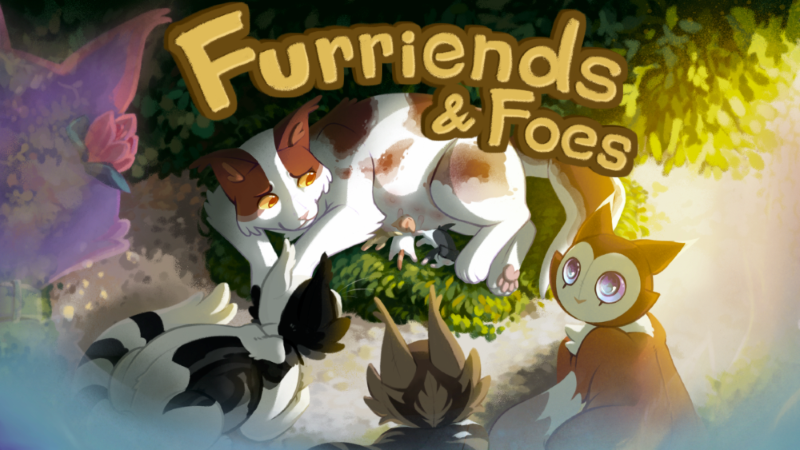
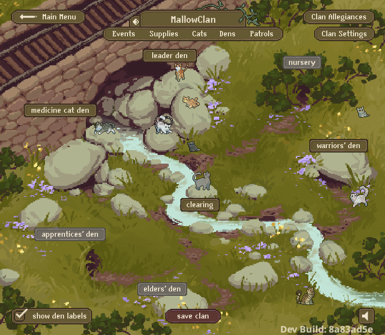
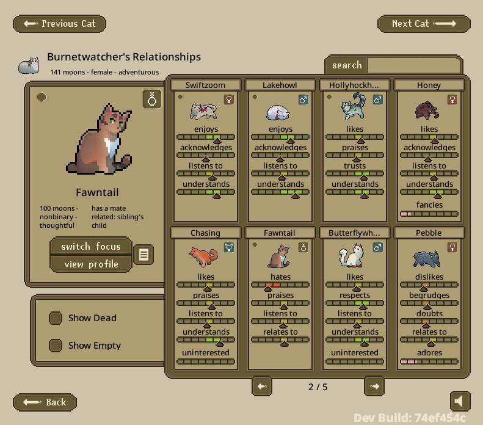
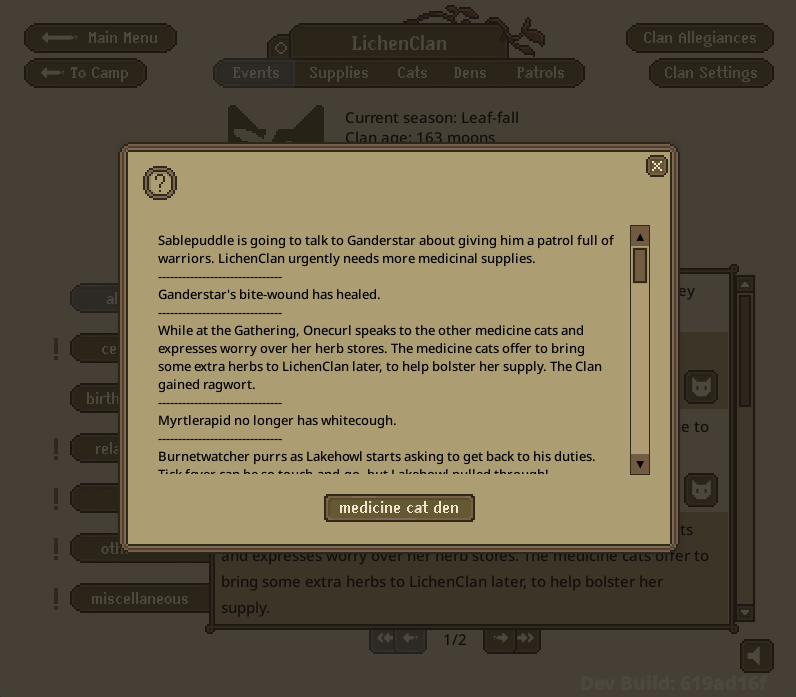
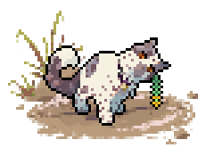
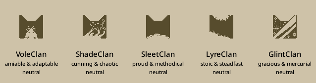
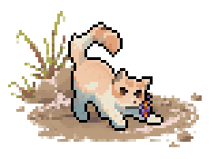
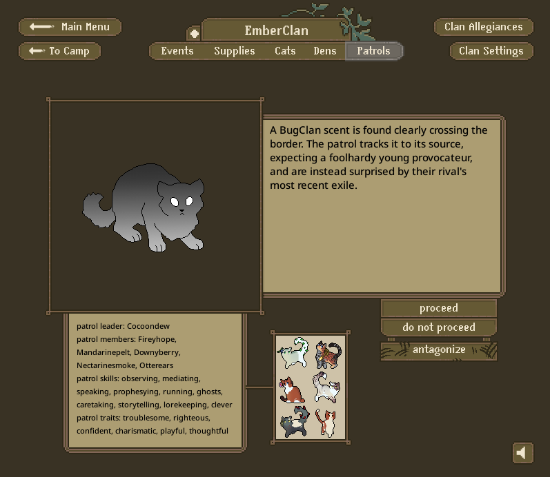

!!! tip "A big world..."
    _"It's a big world out there," the queen tells her new, squirming kits softly. "A world of sounds and sights, full of furriends and foes alike." Her kits already know the Clan, recognizing the scents of those who have visited her to greet them._

Such is life. New relationships, new kits, new adolescents. New sounds, new sights, new adventures... So many new things packed into one update. Whilst our queen gets some much-deserved rest, let's take a more in-depth look at the changes in ClanGen 0.13.0.

<!-- more -->

## **FEATURES**

### New Navigation

///caption
A look at our new navigation and a new camp!
///

For a long time, ClanGen has been in need of some updated navigation UI! As we've added more and more features, they've mostly been tacked onto what already existed. Eventually the navigation became subpar both for players *and* for devs attempting to add to it. Our goal is to bring somewhat-hidden features to the surface and better consolidate information to maximize screen space. We hope this update helps you enjoy the game even more!

  - The top menu bar has been changed to include the Dens dropdown and an entirely new menu dropdown: Supplies.  
  - Supplies allows you to view two new windows: Freshkill and Herbs.
    - The Freshkill management window has the old functionality of the Clearing. You can see all the hungry cats in the Clan, select and feed specific cats (or feed all cats at once!), and easily change Tactics (which have also gotten an upgrade.)
    - The Herb window is more bare-bones but will receive later upgrades. For now, it's just an easy way to access the Medicine Den log and see how the herb supply has changed.  
  - The Camp button has been removed. But fear not! The Camp screen is still here as the "default" screen. You'll notice a new "Back" button on some screens: clicking this will take you back to the Camp! You can also click on the Clan name menu header to return to the Camp.
  - The moon-n-seasons indicator has been greatly changed. It no longer hangs out as a widget on the left side of the screen. Instead, we've integrated it into the top menu as a diegetic element. The vine changes color and design with the season, and the moon icon can be hovered over to see the moon count. This moon icon also changes with each timeskip!  
  - The Events page now features a Save Clan button right next to Timeskip.
  - But wait! What about the Clearing? The Clearing is now where you mediate between your cats! No more must you go to a mediator's profile first in order to access this screen. Instead, make those cats hash out their issues in the middle of the camp for max drama.
  - All cat profiles now feature a den button under the sprite, if that cat has a rank with a corresponding den.

### Relationships System Rework

///caption
A view of the relationship screen with its updated bar displays.
///

Relationships got a facelift! We wanted to improve the existing system to create space for more complexities in relationships, especially on the negative side of them.

  - Relationships are now defined by 5 values: Like, Respect, Trust, Comfort, and Romance.
  - Each value has corresponding tiers: Extreme Neg, Mid Neg, Low Neg, Neutral, Low Pos, Mid Pos, and Extreme Pos. Romance is an exception and only has positive tiers.  
  - Each value tier has a unique name that will be displayed. For example, the Mid Neg tier for Comfort will display as "fears" while the Extreme Pos tier for Like will display as "cherishes".
  - On the backend, the values are a number between -100 and 100 with each tier being a specific range. The Mid tiers have the largest range.
  - The appearance of the relationship bars has gotten a big upgrade to fit with the new system.
  - All patrol and moon events that affect relationships now give an appropriate relationship log.
  - When a patrol changes relationships, it now notifies you! You'll also notice a new button appear that will allow you to view all the newly applied relationship logs for the involved cats.
  - Some events will now apply relationship reactions across groups of cats with certain personalities. For example, if a cat is seen taking food from a Twoleg, their more lawful Clanmates will have a negative reaction.
  - Neutral relationship events were removed and made into thoughts. This is to reduce some of the relationship event bloat by ensuring every relationship event has some kind of impact.

So, how will this be reflected in your current save files? Some relationships might seem to shift a bit! Unfortunately this is unavoidable considering how big of a change this is from the old system. However, we've done our best to try and convert old relationship saves as faithfully as possible.

Additionally:

  - Extended family will now "react" to new litters and have a starting relationship with the new kittens. This reaction will be based on the relative's current relationship with the parents of the kittens. If a cousin really dislikes the parents, they'll likely dislike the kittens as well! This reaction receives a relationship log message.
    - There's a bit of random variability here, so a relative may not view every kitten in a litter the same way. Grandma probably has a favorite grandchild... no matter what she might tell you.
    - Relatives not currently present in the Clan won't have a reaction, as they have no idea the kittens exist!

### Expanded Audio System
Our audio system was recoded from the ground up to allow us more freedom! This was a massive headache, but well worth it.

  - Unique ambient noise tracks were added for all biomes. Certain camps and seasons have unique sound bites that will play at random intervals.
  - 8 new music tracks were added. These will play at random intervals during the game.
  - Music, Ambiance, and Sound Effect volumes can now all be adjusted individually.

### Herb System Rework

/// caption
The new herb supply window gives you a quick view of this moon's medicine den log.
///

The herb system received a rework to make it more complex and hopefully prevent some of the incredible stockpiling we've seen Clans achieve. This includes things like expiration, herb strength, and rarities!

  - Herbs used to treat conditions now have different strengths depending on the condition they are treating.
  - Herbs now have different gathering rarities depending on season and biome.
  - Herbs can now expire, with each type of herb having its own rate of expiration. The medicine den log will inform you if herbs have expired. Expiration is based on when certain "batches" of herbs were found. So, for example, you'll lose the *oldest* juniper rather than *all* the juniper.
  - Medicine cats with a `CAMP` skill can postpone expiration by doing an extra good job storing their herbs. This may not happen everytime. The med den log will inform you when expiration has been postponed.
  - Medicine cats with the `SENSE` skill now gather a wider range of herbs at once than other medicine cats (i.e. 3 moss, 5 juniper, and 2 marigold.)
  - Medicine cats with the `CLEVER` skill now gather a greater amount of herbs at once than other medicine cats (i.e. 12 moss and 10 juniper.)
  - The medicine den now features more interesting "status" messages evaluating the current herb supply.
  - Supply status messages are now generally more accurate to the actual supply amount.
  - Medicine cats now always attempt to gather herbs that they specifically need first. These will be herbs that they're running low on or herbs that are needed to treat conditions currently present in the Clan.
  - The amount of herbs that are gathered at once has been buffed across the board.
  - Permanent conditions can now receive occasional preventative treatment to reduce their risks and chance of death.

### Changes to Afterlives
We're gearing up for some upgrades to how the afterlives are handled. This is only the beginning of our plans and is mostly setting us up for the future.

  - Cats now receive special history text when they die relating to which afterlife they were sent to. With different text depending on if they were accepted to the afterlife without debate, accepted with some controversy, or are kits.
  - Cats cannot yet be rejected from an afterlife, but we're setting up for that sort of feature!
  - Afterlives now have temperaments based on the cats they contain. Only guides, leaders, deputies, and medicine cats can affect this temperament.  This temper is displayed on their list page.

### Multiple Accessories

///caption
This cat is wearing both a collar and gorse.
///

  - Cats can now wear up to 3 different accessories at once!
  - Accessories have been divided up into categories based on the body parts that they cover: `head`, `collar`, `body`, and `tail`. Cats can gain accessories that are part of a category that they don't yet have an accessory for.
  - Each subsequent accessory reduces their chances of getting another accessory.
  - Please note that the "destroy accessory" button doesn't yet allow you to pick a specific accessory! It will destroy *all* the cat's accessories.

### Status Rework
The status system has been entirely reworked!  For a long time, a cat's "status" was a single string (code-talk for a length of text) denoting their rank or place in the world. A loner's rank was "loner", a warrior's rank was "warrior". This worked well for a long time! However, as ClanGen grew more complex it began to demand more information than a single string could provide. Our stopgap measures allowed us to do more but also further tangled the code. To handle some of the complexities we *want* to handle, we needed to change how status worked. The new, more robust system allows us to store significantly more information rather than just a single string.

  - This is largely a backend change, but you'll notice at least a few player-facing changes.
    - Cats now list their Clan in their profile along with their rank (i.e. "LichenClan warrior" instead of just "warrior"). This extends to dead cats ("past LichenClan warrior") and lost/exiled cats ("exiled from LichenClan").
    - Cats who were lost while pregnant and have their kittens while lost will now choose to name their kittens either according to Clan tradition *or* disregard traditional naming. Kittens who take Clan names will continue to change their name as they age, even without ceremonies. If these cats make it back to the Clan without their parent, it will be acknowledged in a special return event!
    - Players can now make cats voluntarily leave their Clan via the dangerous tab in their profile. You can choose if they become a kittypet, loner, or rogue!

  - Those of you who enjoy digging through save files will notice the biggest changes. You'll notice that some parameters are gone: `dead`, `dead_moons`, `outside`, `df`, `exiled`, and `driven_out` to be specific. They've been replaced with `group_history` and `standing_history` which now hold all the status information for a cat.
  - A cat's status is now made up of multiple bits of information, most importantly their `group`, `rank`, `social`, and `standing`.
  - Cats can now be labeled as belonging to a specific `group`. This wasn't previously possible and opens up a lot of new doors for future features. We even track all the groups they've been part of in the past!
  - Cats now have a specific section for `rank`. This also comes with the perk of being able to track all their past ranks, something we weren't at all capable of doing before.
  - Cats now have a `social` label. This can be thought of as their "social caste". There are currently four castes being used: `CLAN_CAT`, `KITTYPET`, `LONER`, and `ROGUE`.
  - Lastly, their `standing` is how a specific group regards them! A lost cat, for example, will be seen as `standing.LOST` to their home Clan rather than `standing.MEMBER`.
  - Most of this information is generally invisible to the player unless they go digging in the files.
  - This was a huge undertaking for us! Unfortunately, it's also very invisible work at the moment. However, it opens up a ton of possibilities for us to pursue in the future, and we're very excited to see where we can take things.

### Group Temperaments

/// caption
What sort of Clans will border you?
///

All Clans have a temperament that was previously only seen in the Leader's Den. We've made some expansions to temperament and some changes to how it's displayed.

  - Temperaments are now two-fold! The previous temperaments were based on the intersection of Aggression and Sociability personality facets (stoic, proud, etc.) Now temperaments have a second side to them denoting the intersection of Lawfulness and Stability personality facets (mercurial, decisive, etc.)
  - StarClan and The Dark Forest now both have a temperament! This is determined by the personality traits of the leaders, deputies, and medicine cats found in each respective afterlife.
  - The calculation used to determine a player Clan's temperament has been adjusted.
    - Leaders have 3x the influence.
    - Deputies have 2x the influence.
    - Medicine cats (who were previously lumped in with the rest of the Clan) now apply influence as a group.
    - The rest of the Clan still applies their influence as a group.
  - Temperaments of afterlives and the player Clan can now be seen on the Cat List screen.
  - When other Clans are generated for a new game, they now attempt to take on temperaments that no other Clan currently has (the intention being to ensure all Clans feel unique).

### New Event Frequency System
Previously, events were manually assigned a "weight" by a developer. This would help dictate how often the event appeared. However, this was very inconsistent and wasn't reflected well in-game. The new system works to improve on this system.

  - Events are now manually assigned a "frequency" by a developer. This is a number between 1 and 4, with 4 being the most frequent.
  - The code itself will evaluate and assign each event with a "weight". This is calculated based on the number of constraints an event has. So the more constrained an event is, the heavier its "weight" will be. For example, a beach-only patrol that requires 2 littermates who like each other will be considered heavier than a any-biome patrol that allows any 3 cats. This means that when an event with high constraints *is* possible, it will be more likely to appear. Previously, we would see these highly constrained events becoming unnaturally rare simply because they have to hit so many specific requirements to even be possible. The new weight system works to counteract this problem.
  - When the game searches for an event, it will first decide what frequency of event it wants. Then it will choose from all events of that frequency. Events with a greater weight will be more likely to be chosen.

### Localization Support
  - While no language localizations are yet available, we've made it far easier to add them with a new, robust localization system.
  - If you have interest in creating a localization, we'd like to direct you to our new [documentation](https://clangen.io/docs/dev/writing/localization/) on the subject!

### Documentation
  - We've got new, improved documentation! While this will forever be a work-in-progress that we continually improve and expand, it does already hold a ton of valuable information about ClanGen development that can be helpful for both devs and modders alike.  It even has a space specifically for user-created guides that we welcome the community to submit work for.  You can find it via our website or this [direct link](https://clangen.io/docs/).

***
## **ART**

### Cat Sprites

///caption
This cat has one of the new sprite poses and one of the new accessories!
///

  - Added three new poses just for our long-hair adolescent kitties!
  - Added two more newborn poses!

  - Added Unknown Residence lineart to give our ghosties a new, foggy look.
  - Added a new eye color: `ORANGE`.
  - `COBALT` eye color saturation increased.
  - `DARKBLUE` eye color brightness decreased.
  - Added new accessories: `WISTERIA`, `ROSE MALLOW`, `PICKLEWEED`, `GOLDEN CREEPING JENNY`, `DESERT WILLOW`, `CACTUS FLOWER`, `PRAIRIE FIRE`, `VERBENA EAR`, `VERBENA PELT`, `ROAD RUNNER FEATHER`.
  - Our range of collars was greatly expanded to 99 different variants. Collars also received a visual overhaul. This came with a change to how collar variants are generated which will conflict with many sprite mods. However, this can be easily addressed by mod creators by modifying a single file. For more information check out the [documentation](https://clangen.io/docs/user-guides/removing-palette-maps/). 
  - Fixed various cat sprite problems.
  - Adjusted following patches to better align with art style or address small inconsistencies: `TOES`, `EXTRA`, `BEARD`, `DIVA`, `FADESPOTS`, `MITAINE`, `RINGTAIL`, `LIGHTSONG`, `PETAL`, `MOON`, `POWDER`, `BLEACHED`, `VITILIGO`, `RAGDOLL`, `PANTSTWO`, `TOPCOVER`, `PRINCE`, `ROSINA`, `BELLY`, `DAPPLEPAW`, `SKUNK`, `SQUEAKS`, `STARS`, `REVERSEPANTS`, `WOODPECKER`, `GLASS`, `BOWTIE`, `TRIXIE`, `FADEBELLY`, `DIGIT`, `BULLSEYE`, `HAWKBLAZE`, `DOUGIE`, `OWL`, `CAKE`, `REDTAIL`, `STREAK`, `SMUDGED`, `SMOKE`, `STREAK`, `MINIMALONE`, `CHIMERA`, `ARMTAIL`, `SIDEMASK`, `EYEDOT`, `PACMAN`, `STREAMSTRIKE`, `MASK`.
  - Slight shading added to cat sprites on the Camp screen that changes depending on where they sit on the background. Cats in bright light will appear brighter, cats in darker spots will appear darker! This is fairly subtle, but helps the cats appear more integrated in their environment.
  - Missing limb and accessory lineart on dead cats is now recolored to match the dead lineart colors.

!!! warning "How does this affect sprite mods?"
    We know how popular sprite replacement mods are! There's been a myriad of changes to how sprites are handled in the game, not to mention that we've added new sprite poses. There's been some spritesheet renaming and splitting, more information on such can be found at the bottom of the [technical section](#technical) of this changelog.

    With regards to the new poses: never fear, modders! The new sprite data json system allows you to easily modify a single file, package that file along with your spritesheets, and the mod will continue working without any new artwork from you. The mod will even continue to work with existing save files, even if you remove a cat pose that was being used in that save. You can find information on how to modify these files in our [modifying sprites](../../dev/art/cat-sprites/adding-new-sprites.md) documentation.

    For players of these mods, you'll have to wait for the creator to update their mod or simply play on an older version of the game.

### Symbols
  - Added new Clan symbols: `BEECH0`, `BLIZZARD0`, `CLAW0`, `CLIFF0`, `DEW0`, `FREEZE0`, `FROZEN0`, `FUMBLE0`, `PUDDLE0`.
  - Fixed issues with some transparent pixels in the Clan Symbols.

### Other
  - Added a new Plains camp called Bridge!
  - Added even more patrol sprites!
  - Rank icons in the Change Role screen have been reworked to be more indicative of their ranks.

***
## **CONTENT**

### Patrols

///caption
Would your Clan welcome in this cat?
///

  - New training patrols featuring apprentices making new friends, teenage angst, interpersonal conflicts, and more!
  - New border patrols featuring toil, playing in puddles, questionable visitors, and more!
  - New herb gathering patrols featuring romance, apprentice interactions, and more!
  - New hunting patrols featuring more romance, salmon runs, and more!

### Moon Events

/// caption
Chasing doesn't seem to get along with these apprentices...
///

  - New war events including things like kit-napping, rescues, loners sharing resources, and more!
  - New leader's den outcomes for bloodthirsty, childish, and cold cats. New failures added involving outsiders.
  - New warrior ceremonies.
  - New death reactions for mates, children, specific traits, and certain types of relationships.
  - New relationship events featuring child/parent relationships, some jealous romance, and more!
  - Added more varied breakup events. There are now many different types of breakups, such as "had_fight" or "decided_to_be_friends", all with unique text events. Each breakup type will affect relationships between the two cats in a different way.
  - Added new "makeup" events for cats who are ex-mates but decide to become mates once again! This even includes special events for rejection of an ex-mate.
  - New birth events that skew towards a more negative light.
  - Added a new type of event called "hidden_murder_reveal". Some murders might appear to be an innocent accident! Until something more is revealed...
  - Added a new type of event called "failed_murder". Some would-be murderers might have their plans foiled... Perhaps they'll succeed next time.
  - Kittens 3 moons or older can now come out as transgender.
  - Grief events have been adjusted. You'll notice them being shorter and that some of the removed text now appears as grief thoughts.

### Misc
  - New thoughts featuring current conditions, various adolescent experiences, patrolling, reactions to new litters, and many more.
  - Cats will now receive new thoughts in response to specific events such as birth or rank change.
  - New Dark Forest leader ceremony options.
  - Added more biome-specific snippets.
  - Added more explanatory focus-based text.
  - Added new prefixes, suffixes, and loner names.
  - Removed or edited some existing names to better fit within our current guidelines.
  - New conditions and related events: strange lump, absent, tick fever, selective mutism, damaged throat, sore throat, and breathless fit.
  - Guides now have unique backstories.
  - Variety of edits to existing events to reword, rework, or shorten them.

***
## **QUALITY OF LIFE**

### User Interface
  - Cat sprites on the Camp screen now have better click detection. The clickable area of these sprites is now cat-shaped, meaning you can more easily click cats that are being slightly covered by other cats.
  - The Events display now features pagination in addition to the scrollbar. This gets rid of the issue large Clans would experience where the number of events made scrolling entirely impossible or would crash/lag the game to an extreme degree.
  - General game settings can now be accessed through the Clan Settings screen rather than requiring you to return to the Main Menu entirely.
  - Cyrillic added to the ClanGen font.
  - Credits screen got a facelift.
  - Cat list now displays the temperament of the group being viewed.
  - Improvements to the look and behavior of pop-up windows.

### Misc
  - Dead cats can now be sent to the Unknown Residence by players.
  - The game no longer has to close when you switch Clans! Yay!!
  - You can now have multiple save files with the same Clan name! Clans are now identified by the code via a unique ID rather than their Clan name.
  - The histories of murderers and their victims will now note if anyone in the Clan is aware of the truth.
  - Leader death history is now displayed more clearly and cleanly.
  - Unmated affairs (co-parenting) and mated affairs (cheating) can now be toggled individually.
  - Moon events will repeat less often.
  - Assorted performance improvements.
  - Loner names have been split into three categories: Loner, Silly, Human. The type of outsider will determine which category their name comes from (for example, a kittypet will be more likely to take a silly or human name while a rogue will be more likely to take a loner name or a name from the list of Clan prefixes.)  The intention is to better control the assignment of names that feel appropriate to the cats they're being given to.

***
## **BALANCING**

### Wars
  - Events with non-warring Clan are now available even while at war.
  - Death and injury chances greatly increased while at war and in a relation decrease war state, especially for leaders.
  - Relations threshold for war ending was increased. Some Clan temperaments change how high relations needs to get in order for war to end.
  - Decreased the relation bonus applied when wars end.
  - Bias towards relation-increasing war events was removed.
  - First moon of a war is now always a relation decrease state, giving it a higher chance of injury/death.
  - Chances of war events reduced on moons where the war state is neutral or relation increase.

### Murder
  - Adjusted a cat's chance to murder to be more greatly influenced by personality and current relationship to their target. The presence of "high negative" relationship logs no longer has such a large impact.
  - Cats will now always target the cat that they have the worst relationship towards, rather than randomly choosing from all cats they have any negativity towards.
  - Ambitious deputies gain a further murder chance buff when targeting their leader.

### Misc
  - Adjusted the effects of lack-of-treatment on cats with permanent conditions.
  - Adjusted the calculation for determining if herb supply is adequate for Clan size to be more forgiving.
  - Altered medicine cat apprentice odds to allow more than one medicine cat apprentice at once, boost odds of "suitable" kits being selected, and lower odds of "unsuitable" kits being selected.
  - The "loving" trait has had some content adjustments to better distinguish it from "compassionate".
  - Cats with the `CAMP` skill now reduce the chance of supply reduction events (aka, events that wipe our the freshkill/herb supply).

***
## **BUGFIXES**

  - Fixed Discord Integration becoming "stuck" despite ClanGen being closed or the setting being turned off. If you're still experiencing stuck activity try turning the setting off and restarting Discord.
  - Fixed a variety of pronoun and tagging errors within events.
  - Fixed variety of typos within events.
  - Fixed typo leading to cat-bite wounds never scarring.
  - Fixed crooked jaw being unnaturally rare due to issue with its scars.
  - Fixed a problem with the debug menu layering.
  - Fixed issues with debug menu commands.
  - Fixed raid focus causing crash.
  - Fixed cats getting sick with no notification due to focus.
  - Fixed bug where a warning about invalid horizontal anchors appeared on opening the Make Clan screen.
  - Fixed an issue where the "show living" and "show dead" buttons would display improperly when the player has a dead cat list open and switches to another menu, then switches back to the cat list with the main menu "cat list" button.
  - Fixed a bug with cat lists where if you entered a cat's profile before navigating away to another screen such as camp or patrol, the current group (StarClan, DF, etc.) you had before clicking on the most recent cat sprite would load again when returning to the cat list.
  - Fixed a bug with cat lists where if you entered a StarClan/DF/UR cat's profile and opened a screen from there (such as the "choose mate" or "see relationships" screen), then went back to the cat list from their profile, the displayed group would be switched back to the living Clan
  - Fixed mute button clipping text on the MakeClanScreen.
  - Fixed cats acting like they witnessed a murder that they couldn't possibly have seen.
  - Fixed heterochromia odds to correctly increase for cats with mostly/high/full white patches.
  - Fixed instances of cats being included as "involved" in an event even though they hadn't been mentioned.
  - Fixed April Fools hats not appearing on April Fools.
  - Fixed Fjord not being included as an option when randomly choosing a camp or quickstarting a Clan.
  - Fixed level 1 HEALER cats not giving their intended minor buff to healing.
  - Fixed scroll containers not always responding to mouse scroll wheel input.
  - Fixed leaders being immune to death during war.
  - Fixed skills not displaying on the mentor select screen.
  - Newborns should appear less often in events inappropriate for them.
  - Death history for cats who were previously a leader, but no longer are due to leaving the Clan in some fashion, is now formatted correctly.
  - Save Clan button now scales correctly in fullscreen.
  - Newborns can now receive a myriad of thoughts instead of being stuck in the default until the Clan is reloaded.
  - Fixed injuries sometimes being creating inappropriate scars or permanent conditions.
  - Thoughts implying that a cat has held a certain rank are now assigned more appropriately.
  - Old age events involving two cats now check that both cats cross the old age threshold.
  - Newborns no longer take part in relationship events.
  - Fixed the "same age" calculation used for retrieving cats of a similar age to another cat for relationship events.

***
## **TECHNICAL**

  - Tints use `null` instead of `"none"` to indicate no tint.
  - Facets can be `null` and will be regenerated.
  - `patrol` folder is now within the `events_module` folder.  Since patrols are events, this seems more intuitive.
  - Added a new way to "chain" events together via `FutureEvent`. We can now instruct the code to "queue" up specific events in response to other events. At the moment this is mainly being utilized for murders and their subsequent reveals.
  - `ShortEvent` and `OngoingEvent` classes are now in their own scripts: `short_event.py` and `ongoing_event.py` respectively; and their own folders: `short` and `ongoing` respectively.  This brings them more in line with how the `patrol` folder is set up.
  - `disaster_events.py` is now contained in the `ongoing` folder.
  - `relation_events.py` is now contained in the `relationship` folder.
  - `condition_events.py`, `handle_short_events.py`, and 'scar_events.py` are now contained in the `short` folder.
  - Created shared event filter functions to be held within `event_filters.py`.
  - Mediator events are now handled as ShortEvents.
  - Debug menu code has been improved.
  - Added new debug command for generating, removing, editing, ect. of pregnancy.
  - Added new debug command for changing the biome temporarily.
  - The way that pronouns are saved in a cat has been changed. Anything that was formerly stored there is now stored in a dictionary key with the "en" value - in other words, as English pronouns. This allows for cats to have different pronouns in different languages.
  - On that subject, default pronouns have been moved out of `cats.py` and into `resources/lang/en/pronouns.json`. This technically means that players can now modify the default pronouns for cats in English.
  - Status system received a full refactor.
  - History class has been refactored.
  - `game` has been declassified and refactored.
  - `handle_short_events` has been removed and the majority of its functions moved to be part of the ShortEvent class.
  - `thoughts` has been declassified and refactored to allow better categorization and assigning of specific thoughts in response to events.
  - Declassified the `events` class.
  - Declassified `all_screens`.
  - Added a way to exclude specific involved cats from being displayed as involved in an event
  - Added new custom UI subclasses including things like dropdowns and checkboxes. These can be found in `ui/elements`.
  - `windows.py` split into multiple files found in `ui/windows`.
  - `utility.py` split up into multiple files.
  - Greatly reduced circular dependency risks via splitting data away from unrelated logic.
  - New symbols added to the Clangen font.
  - New game_config settings for debugging short events specifically.
  - Moved more variables into game_config.
  - game_config switched to a `toml` filetype instead of `json`.
  - prey_config switched to a `toml` filetype instead of `json`.
  - Sprite generation was greatly refactored to reduce the amount of work required to add new sprites. For more information, especially on how to bring mods up to date, check out the [documentation](https://clangen.io/docs/dev/art/cat-sprites/adding-new-sprites/). 
  - Most event parameters can now utilize exclusionary values.
  - Instead of all related cats' family trees being cleared and rebuilt from scratch every time cats are added (such as kits being born), now only the relevant functions will run to add the new cat.
  - Renamed many sprite files for the sake of organization and consistency.
    - `collars` > `acc_collars`
    - `medcatherbs` > `acc_plants`
    - `wild` > `acc_wilds`
    - `agouticolours` > `colours_agouti`
    - `bengalcolours` > `colours_bengal`
    - `classiccolours` > `colours_classic`
    - `mackerelcolours` > `colours_mackerel`
    - `marbledcolours` > `colours_marbled`
    - `maskedcolours` > `colours_masked`
    - `rosettecolours` > `colours_rosette`
    - `singlecolours` > `colours_single`
    - `singlestripecolours` > `colours_singlestripe`
    - `smokecolours` > `colours_smoke`
    - `sokokecolours` > `colours_sokoke`
    - `speckledcolours` > `colours_speckled`
    - `tabbycolours` > `colours_tabby`
    - `tickedcolours` > `colours_ticked`
    - `tortiepatchesmasks` > `patches_tortie`
    - `eyes2` > `eyes_right`
    - `gradient_ur` > `line_ur_gradient`
    - `aprilfoolslineart` > `lineart_aprilfools`
    - `lineartdf` > `lineart_df`
    - `aprilfoolslineartdf` > `lineart_df_aprilfools`
    - `lineartdead` > `lineart_sc`
    - `aprilfoolslineartdead` > `lineart_sc_aprilfools`
    - `aprilfoolslineartur` > `lineart_ur_aprilfools`
    - `lineartur` > `lineart_ur`
    - `missing_scars` > `scars_missing_part`
    - `lightingnew` > `shader_lighting`
    - `shadersnewwhite` > `shader_mask`
  - Split the single white patch sprite sheet into smaller sheets for each of its categories. Spritesheets are now:
    - `patches_points.png`
    - `patches_vitiligo.png`
    - `patches_white_high.png`
    - `patches_white_little.png`
    - `patches_white_mid.png`
    - `patches_white_mostly.png`
  - Heterochromia has been converted to a masking system.
  - Collars have been converted to a palette mapping system.

